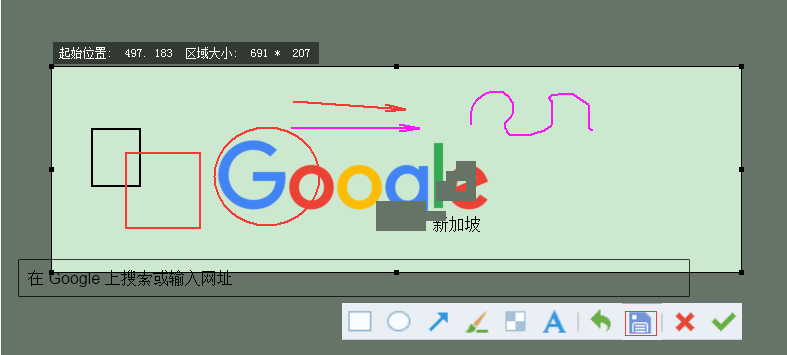

# Screen

### 功能：Win系统下 截图功能实现

	程序说明
	
		时间：2012.3.2
		
		编译环境： Win7+ VS2010.
		
		功能：程序实现了类似qq截图的一些功能。

### 图片：

### 问题：

1、代码中获取颜色是根据API获取的，当存在坐标转换时取颜色是失败的。

2、问题： 截图中的按钮功能，间距调的不合理。

3、添加文字尚未实现 ，如果有需要的自己练习吧。
